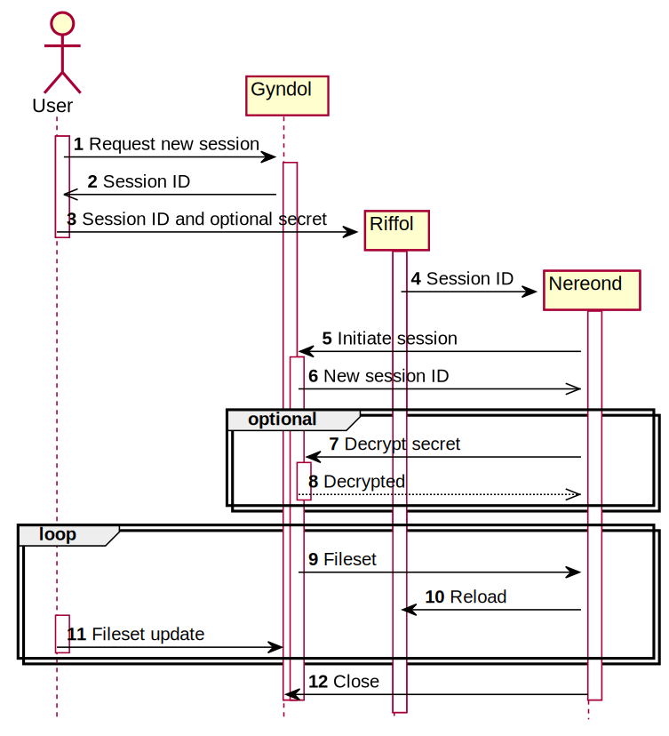

= Bootstrapping Riffol and Nereond with Gyndol

== Notes:

Messages 1 and 2 are over a secure connection whereby User has
authenticated (logged in directly, logged in over ssh or
signed in via a web page).

The session ID is a TOTP which will expire after just a few
seconds. This ID must be sent, in message 5, within this expiration
period in order for the session to initialise. The expiration time can
be configured as part of the request (message 1). The ID is
sufficiently long to prevent guessing or accidental collisions.

The ID is stored in the environment of the machine which will be
running Nereond. This is message 3 in the diagram. If Riffol is being
used on the machine, it will pass the environment variable on to
Nereond (message 4) and Riffol will be configured to run Nereond as
its sole application.

Nereond takes the session ID from the environment and initiates the
session with Gyndol (message 5) which generates a new session ID
(message 6). The session initiation is now complete. Nereond can
reconnect using the new ID should this connection fail.

Nereond asks for the fileset (messages 9 and 10) and unpacks
it. Nereond then signals Riffol to reload (message 11), this time with
the full configuration from the fileset.

Any changes to the fileset cause Gyndol to notify Nereond (message 12)
which updates its local files and signals Riffol to reload again
(message 11).

Files with sensitive information can be held encrypted in Gyndol's
fileset. Gyndol treats these as any other file but Nereond needs a key
or passphrase to decrypt them. To avoid having this secret in plain
text, User can encrypt it using Gyndol's public key and pass it to
Nereond with the session ID (message 3), via the environment. Nereond
can then request Gyndol to decrypt the secret using the optional
messages 7 and 8. Nereond will then have the secret necessary to
decrypt any encrypted files in the fileset.